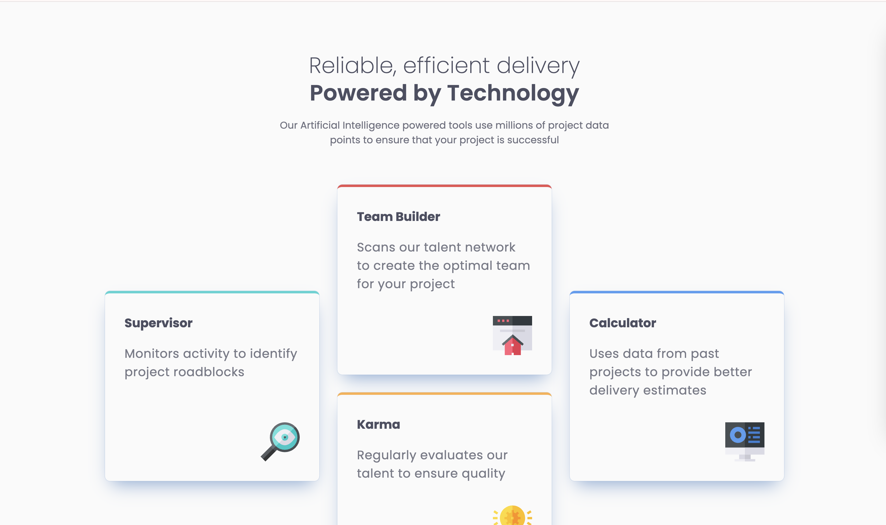
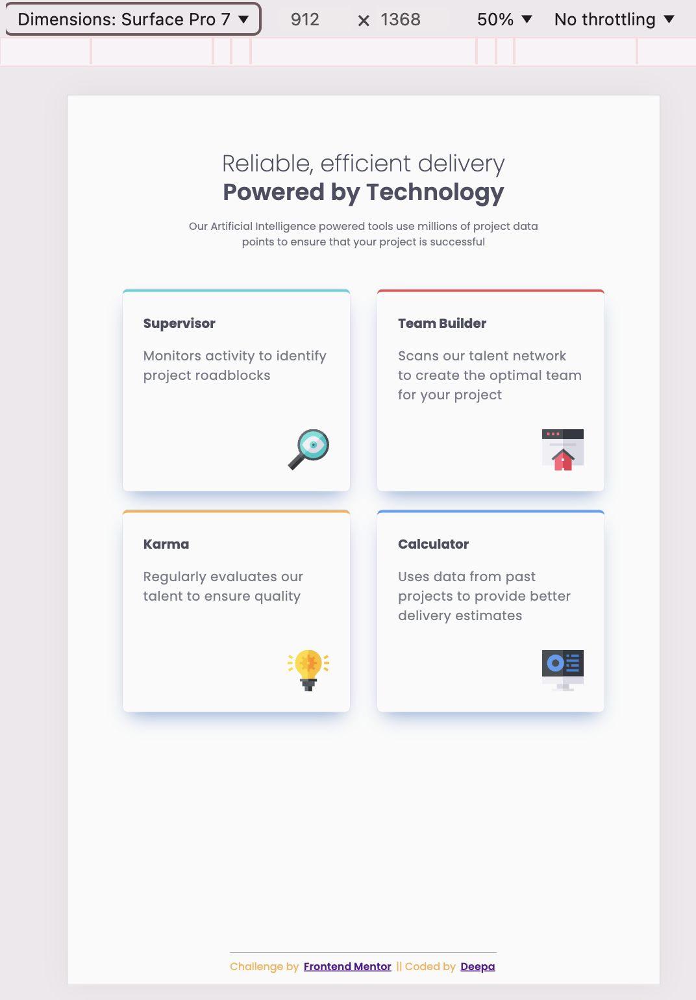
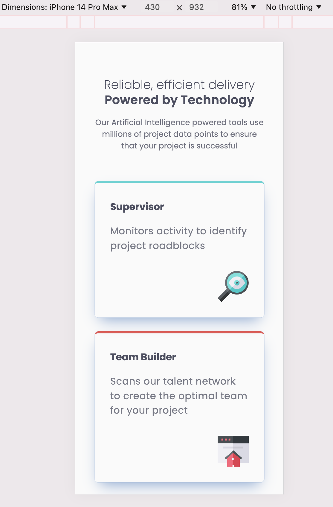

# Four card feature section solution

This is a solution to the [Four card feature section challenge on Frontend Mentor](https://www.frontendmentor.io/challenges/four-card-feature-section-weK1eFYK). Frontend Mentor challenges help you improve your coding skills by building realistic projects. 

## Table of contents
- [Overview](#overview)
  - [The challenge](#the-challenge)
  - [Screenshot](#screenshot)
  - [Links](#links)
- [Author](#author)

## Overview

### The challenge

Users should be able to:

- View the optimal layout for the site depending on their device's screen size

### Screenshot

Tablet            |  Mobile
:-------------------------:|:-------------------------:
  |  

### Links

- Solution URL: https://github.com/sdkdeepa/Four-card-feature-section

- [Site hosted in ](https://sdkdeepa.github.io/four-card-feature-section/)

## My process

### Built with
- Semantic HTML5 markup
- CSS custom properties
- Flexbox
- CSS Grid
- Mobile-first workflow

## Author

**Frontend Mentor - [@sdkdeepa](https://www.frontendmentor.io/profile/sdkdeepa)**

